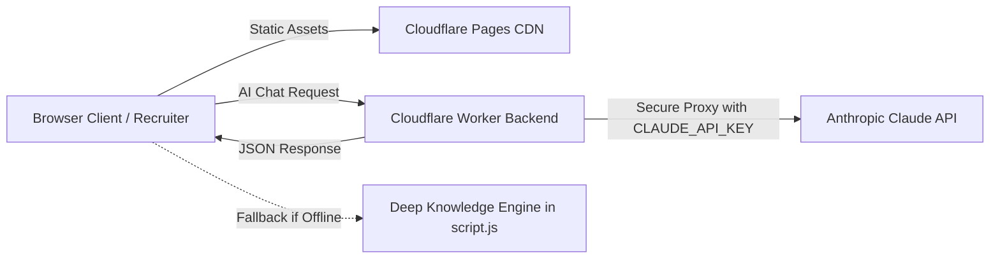

# Wassim Bannour | Developer Portfolio & AI Twin Serverless Backend

A high-performance, cybersecurity-themed developer portfolio and serverless AI Twin backend for **Wassim Bannour** (RHCSA & PCAP Certified Software Engineer, Top 33 Global IEEEXtreme Winner).

Architected for **100% Free Hosting** on **Cloudflare Pages** (Frontend) and **Cloudflare Workers** (AI Backend).

---

## 📁 Production Repository Structure

```text
my-portfolio/
├── index.html         # Frontend layout, cyber HUD styling, and AI Chat widget
├── script.js          # Matrix canvas, skill filtering, AI client & Deep Knowledge Engine
├── worker.js          # Cloudflare Worker ES module proxying Anthropic Claude API
├── wrangler.toml      # Cloudflare Worker deployment configuration
├── README.md          # Comprehensive deployment & architecture guide
└── wassim_bnannour_cv.pdf  # Source CV
```

---

## 🏗️ Architecture Overview



---

## 🚀 Step-by-Step Deployment Guide

### Step 1: Push Repository to GitHub

1. Open PowerShell / Terminal in your project directory:
   ```bash
   cd c:\Users\sassi\OneDrive\Desktop\myportfolio
   ```

2. Initialize and commit:
   ```bash
   git init
   git add .
   git commit -m "Production release: Cyber-security portfolio & AI Twin backend"
   ```

3. Link to your GitHub repository and push to `main`:
   ```bash
   git branch -M main
   git remote add origin https://github.com/WassimBannour1/my-portfolio.git
   git push -u origin main
   ```

---

### Step 2: Deploy Cloudflare Worker Backend

You can deploy the backend using either **Method A (CLI)** or **Method B (Web Dashboard)**:

#### Method A: Via Wrangler CLI (Recommended)
1. Authenticate with Cloudflare:
   ```bash
   npx wrangler login
   ```

2. Set your Claude API Key secret:
   ```bash
   npx wrangler secret put CLAUDE_API_KEY
   ```
   *(Paste your Anthropic API Key `sk-ant-...` when prompted)*

3. Deploy the Worker:
   ```bash
   npx wrangler deploy
   ```
   *Your live endpoint will be displayed: `https://wassim-portfolio-backend.<your-subdomain>.workers.dev`.*

#### Method B: Via Cloudflare Web Dashboard (No CLI Needed)
1. Go to [dash.cloudflare.com](https://dash.cloudflare.com/) ➔ **Workers & Pages** ➔ **Create application** ➔ **Create Worker**.
2. Name it `wassim-portfolio-backend` and click **Deploy**.
3. Click **Edit code**, delete starter code, paste the contents of `worker.js`, and click **Deploy**.
4. Go to **Settings** tab ➔ **Variables and Secrets** ➔ click **Add** under *Secrets*:
   - Variable name: `CLAUDE_API_KEY`
   - Value: Paste your Anthropic API key (`sk-ant-...`) ➔ Click **Save and Deploy**.
5. Copy your live Worker URL (e.g. `https://wassim-portfolio-backend.<your-subdomain>.workers.dev`).

---

### Step 3: Deploy Frontend on Cloudflare Pages (Free)

1. In the [Cloudflare Dashboard](https://dash.cloudflare.com/) ➔ **Workers & Pages** ➔ **Create application** ➔ **Pages** ➔ **Connect to Git**.
2. Select your repository: `WassimBannour1/my-portfolio`.
3. Configure build settings:
   - **Framework preset**: None (Static site)
   - **Build command**: *(Leave blank)*
   - **Build output directory**: `/` (Root directory)
4. Click **Save and Deploy**. Your site is now live at `https://wassim-bannour.pages.dev` (or your custom domain).

---

### Step 4: Configure Worker URL in AI Chat

1. Open your portfolio in the browser.
2. Click the **AI Twin Chat** button (bottom-right floating icon or header button).
3. Click the **⚙️ Settings** gear icon in the chat header.
4. Paste your Cloudflare Worker URL (e.g. `https://wassim-portfolio-backend.xyz.workers.dev`) and click **Save & Apply**!
5. Click **Test Worker** to verify live connectivity (a green confirmation badge will appear).

---

## ⚡ Built-in Autonomous Deep Knowledge Engine

Even before your Cloudflare Worker is deployed or if the Anthropic API is temporarily offline:
- The AI Twin operates autonomously via an embedded **Deep Knowledge Engine** in `script.js`.
- It accurately answers questions regarding Wassim's:
  - **RHCSA & PCAP Certifications**
  - **IEEEXtreme 17.0 #33 Global & 2nd National Rank**
  - **TEK-UP & ISIMM Academic Degrees**
  - **SW CONSULTING AI/OCR & TEAM DEV Industry Experience**
  - **Technical Stack & Tools**
  - **Direct Contact Information**

---

## 🛡️ Security Best Practices

- **Zero Client Key Exposure**: The Anthropic API key is stored securely in Cloudflare environment secrets (`env.CLAUDE_API_KEY`).
- **Strict CORS Protection**: Preflight `OPTIONS` and cross-origin headers are enforced across all endpoints.
- **Client Persistence**: Configured Worker endpoints are persisted locally in `localStorage` (`WB_WORKER_URL`).
